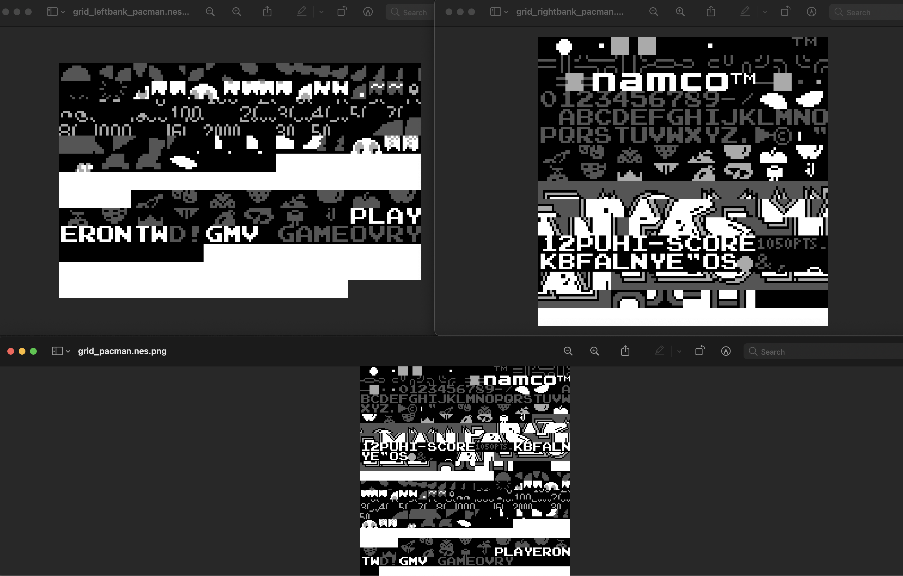

A NES rom info analyzer and tilset extractor.
Supports both iNES 1.0 and iNES 2.0 formats.

PS: No mapper support for tileset.

## Usage

```
./sengo <ROM>.nes
```

### Examples:

```shell
./sengo pacman.nes
Header         : 4E45531A010100080000000001000001 (iNES 2.0)
ROM Size       : 24 KB (CRC: 81210F63)
Trainer Size   : 0 KB
PRG-ROM Size   : 16 KB (CRC: 6FA1193B)
CHR-ROM Size   : 8 KB (CRC: 19C4AA76)
Misc-ROM Size  : 0 KB
----
PRG-RAM Size   : 0 KB
CHR-RAM Size   : 0 KB
----
PRG-NVRAM Size : 0 KB
CHR-NVRAM Size : 0 KB
----
Mapper         : 0
Submapper      : 0
Mirroring      : Horizontal or mapper-controlled
Battery        : No
----
TV System      : Western Europe, Australia
Console        : Regular NES/Famicom/Dendy
Exp. Device    : Standard NES/Famicom controllers
CPU/PPU Timing : RP2C07 ("Licensed PAL NES")
There are 512 tiles in this CHR ROM
```

This extracts all the tiles (in this example 512 individual `png` files) and also another 3 overview grid images as well: the two banks (left & right) and one with both banks altogether.

```shell
$ ls *grid*.png
grid_leftbank_pacman.nes.png  grid_pacman.nes.png           grid_rightbank_pacman.nes.png
```


